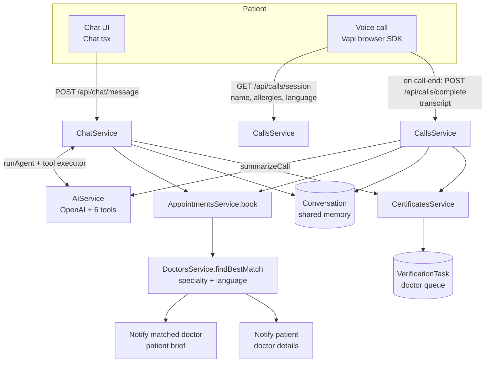

# MedAssist — Architecture

Read this before touching code. It maps the system, the four request flows that
matter, and where the seams are so we can work in parallel without collisions.

- Setup and demo credentials → [SETUP.md](SETUP.md)
- What to build next and why → [FEATURES.md](FEATURES.md)
- Document upload & AI reading track → [WORK-PRITHA.md](WORK-PRITHA.md)

---

## 1. What this is

A patient talks to an AI health assistant by **chat** or **voice**. The AI
triages, then produces artifacts a **real doctor must verify** before they count:

- a **call-back appointment**, routed to the best-matched doctor by specialty
- a **medical certificate** draft → doctor signs → PDF
- an **analysis of an uploaded medical report** → doctor approves

The non-negotiable rule of the domain: **the AI never has the final word.**
Every clinical output lands in a doctor's verification queue first.

## 2. Stack

| Layer | Choice |
|---|---|
| Backend | NestJS 11, Mongoose 9, MongoDB 7 (Docker, host port **27018**) |
| Frontend | Vite 8 + React 19 + react-router-dom 7, plain `fetch`, plain Context |
| LLM | OpenAI SDK (`gpt-4o-mini` default, chat + vision) |
| Voice | Vapi (browser SDK on the client, assistant hosted at Vapi) |
| PDF | pdf-lib |

No Redux/react-query, no CSS framework, no WebSockets, no job queue. "Live"
data is 20-second polling. Keep it that way unless there's a reason.

## 3. Repo layout

```
apps/backend/src/
  main.ts                 global prefix /api, CORS, ValidationPipe
  app.module.ts           module wiring
  config/                 env + Mongo connection
  common/                 guards, decorators, mongoose.util
  modules/                13 feature modules (table in §6)
  scripts/                seed.ts, setup-vapi.ts
apps/frontend/src/
  api/                    client.ts (fetch wrapper), call.ts (Vapi), types.ts
  store/auth.tsx          the only global state
  components/             5 patient screens, 4 doctor screens, shell
  audio/ringtone.ts       synthesized ringtone (Web Audio, no asset)
docker-compose.yml        mongo only — no app containers
```

## 4. The two AI entry points

Both funnel into the same records. This is the single most important thing to
understand about the system.



Two things to internalise:

1. **Tools execute for real, inside the agent loop.** `AiService.runAgent` takes
   a `ToolExecutor` callback; `ChatService.executeAction` runs it and the *actual*
   result (appointment id, matched doctor, or `{error}`) goes back to the model
   before it writes its reply. That is why the agent can say "matched with
   Dr. Rohan Mehta (Cardiology)" truthfully.
2. **Voice and chat share one `Conversation`.** A finished call appends its
   summary as an assistant message, so the chat agent remembers the call.

## 5. The four request flows

### A. Chat message
`POST /api/chat/message` → [chat.service.ts](apps/backend/src/modules/chat/chat.service.ts)

1. Load patient + `getOrCreate` conversation, persist the user message
2. Build `PatientContext` (name, language, allergies, conditions, medications)
3. `AiService.runAgent(context, history, text, executor)` — up to 4 tool rounds
4. Each tool call runs immediately via `executeAction`; result feeds back
5. Persist the assistant message with `metadata.actions`
6. Return `{ reply, actions, conversationId }` — the UI renders `actions` as cards

**The 6 tools** (defined in `AiService.tools()`, executed in `ChatService.executeAction`):

| Tool | Effect |
|---|---|
| `book_consultation` | creates appointment, matches + notifies doctor and patient |
| `request_certificate` | AI drafts → `awaiting-doctor` + verification task |
| `emergency` | notification with 112 / 108 |
| `set_language` | updates conversation + patient |
| `get_my_records` | **read** — appointments, certificates, documents |
| `find_doctor` | **read** — verified doctors by specialty |

Adding a tool = add the schema in `tools()` **and** a `case` in `executeAction`.
Both, or the model calls something that returns `{error: 'Unknown tool'}`.

### B. Voice call
Browser talks to Vapi directly; the backend is only involved at the two ends.

1. `GET /api/calls/session` (authenticated) → `assistantId`, `variableValues`
   (`patientName`, `knownAllergies`, `knownConditions`, `medications`, `language`)
   and a name-aware `firstMessage`. **This is how the agent knows who is calling.**
2. Client collects final transcript lines from Vapi `message` events
3. On `call-end` → `POST /api/calls/complete` with the transcript; the patient
   comes from the **JWT**, never the body
4. `processCompletedCall`: `summarizeCall` → book (if `book_consultation` or
   urgency is urgent/semi-urgent/emergency) → honour `requestedCertificate` →
   `call-note` verification task → append summary to the conversation

`POST /api/calls/vapi/webhook` is the same pipeline for **phone** calls, resolving
the patient by number. Both converge on `processCompletedCall`, which short-circuits
if `session.summary` already exists so a duplicate report can't double-book.

> Phone calls need `VAPI_WEBHOOK_URL` tunnelled. **Browser calls do not** — that's
> the point of the client-side transcript path.

### C. Document upload + analysis

**Decision: uploaded images are never stored.** No S3, no bucket, no file on
disk. The patient's device sends the image, the AI extracts what it needs, and
the bytes are discarded within the same request. We keep only the *findings*.

That makes it a **single endpoint**, not two — if upload and analysis were
separate calls the bytes would have to survive in between, which is exactly what
we're avoiding.

```
POST /api/documents/analyze   (multipart, one request)
  file arrives in memory (multer memoryStorage, never touches disk)
    → base64 → OpenAI vision
    → save MedicalDocument { filename, mimeType, size, aiFindings }   ← no bytes
    → create VerificationTask for a doctor
    → buffer garbage-collected
```

Consequences, all deliberate:

- There is **no** `GET /api/documents/:id/file`. Nothing to serve.
- The doctor verifies against `aiFindings.text` (the raw text the AI read) rather
  than the original image. **That text is the only surviving record of what the
  document said**, which makes populating it well a correctness requirement, not
  a nicety.
- Re-analysis is impossible — one shot per upload. If it fails, the patient
  re-uploads.
- Two security gaps disappear for free: no patient images at rest, and no
  `ServeStaticModule` publishing `/uploads` unauthenticated.

> Generated **certificate** PDFs are different — those stay on disk under
> `apps/backend/certificates/` because the patient has to download them. Only
> *uploaded* patient images are ephemeral.

**Status: the vision call currently returns empty findings, and the
upload/analyze split is still the old two-endpoint shape.** Both are
[Pritha's work](WORK-PRITHA.md).

### D. Doctor verification
`GET /api/verification/queue` → `POST /api/verification/:id/approve|reject`

`approve()` deliberately calls `applyDecision()` **before** setting
`status: 'approved'`, so a failed side effect (PDF generation blowing up) leaves
the task `pending` instead of silently marking it done. There is a test pinning
this. Don't reorder it.

`applyDecision` dispatches on `taskType`: `document` → approve, `certificate` →
issue PDF, anything else → notify the patient.

## 6. Module map

| Module | Owns | Notable |
|---|---|---|
| `auth` | User, register/login/me | **Phone is the login id.** Hand-rolled scrypt, JWT carries `patientId`/`doctorId` |
| `patients` | Patient profile | `PATCH /me` uses an explicit `UpdatePatientDto` allowlist |
| `doctors` | Doctor roster | `findBestMatch(specialty, language)` — the routing brain |
| `appointments` | Call-back lifecycle | `book()` does the matching + both notifications |
| `conversations` | Conversation + Message | One conversation per patient, forever |
| `chat` | Text agent | Owns `executeAction` |
| `calls` | CallSession, Vapi | `getWebSession`, `completeWebCall`, webhook |
| `documents` | Upload + vision | ⚠️ analysis broken |
| `certificates` | Draft → sign → PDF | pdf-lib, Helvetica (**ASCII only**) |
| `verification` | Doctor queue | Polymorphic `refId`, no `refPath` |
| `notifications` | In-app bell | Poll-only, no push/SMS |
| `admin` | Dashboard counts | 9 `countDocuments` + recents |
| `ai` | OpenAI wrapper | No controller. `runAgent`, `analyzeDocument`, `summarizeCall`, `draftCertificate` |

`AiModule` is imported by `chat`, `calls`, `documents`, `certificates` — **not** by
`app.module.ts`.

## 7. Data model

9 collections, all `{ timestamps: true }`.

```
User ──1:1── Patient ──┬── Conversation ──< Message
 │                     ├──< Appointment >── Doctor (doctor + suggestedDoctor)
 │                     ├──< MedicalDocument
 │                     ├──< Certificate >── Doctor
 │                     ├──< CallSession
 │                     └──< VerificationTask (polymorphic refId)
 └──< AppNotification
User ──1:1── Doctor
```

Fields worth knowing:

- `Appointment.suggestedDoctor` + `suggestedSpecialty` — the AI's match. Status
  stays `requested`; a doctor still claims it via `assign()`. `doctor` is set on claim.
- `Appointment.aiNotes` — free-form; carries `symptoms` and `urgency` from calls.
- `CallSession.source` — `'web'` (client-posted) or unset for phone.
- `VerificationTask.refId` — points at a document / certificate / call session
  with **no `refPath`**, so it can never be `.populate()`d. The denormalised
  `aiOutput` snapshot is what the doctor UI reads.
- `MedicalDocument.aiFindings` — the vision output, and **the only record of the
  uploaded image** (see §5C — we don't keep the bytes). `status` walks
  `pending → awaiting-doctor → approved|rejected` (`'ai-reviewed'` is in the enum
  but never used). `filePath` is a leftover of the old store-on-disk design and
  is being removed.

**`Doctor.verified` defaults to `true`** and `POST /auth/register` accepts
`role: 'doctor'`. Anyone can self-register as a verified doctor and read every
patient's records. Acceptable for a hackathon demo; say so if we present it.

## 8. Auth & authorization

- `JwtAuthGuard` — hand-rolled, no Passport. Verifies `Bearer`, attaches `request.user`
- `RolesGuard` + `@Roles('patient')` — **returns `true` when no `@Roles` is present**
- `@CurrentUser()` → `{ userId, role, phone, patientId?, doctorId? }`

Authorization rests on `patientId` / `doctorId` **from the token**. Two rules:

1. **Never** take an owner id from the request body or a query param.
2. For any `:id` route, scope it. Documents and certificates use
   `findOwned(id, patientId)` / `pdfPath(id, patientId)` — pass `undefined` for
   doctors so they can review anything, the patient's own id otherwise. Returns
   **404, not 403**, so we don't confirm the record exists.

Guarded file downloads need `openAuthedFile()` from
[client.ts](apps/frontend/src/api/client.ts) — a plain `<a href>` sends no bearer
token and 401s.

## 9. Config

`apps/backend/.env` (see `.env.example`):

| Key | Notes |
|---|---|
| `MONGO_URI` | **port 27018** to match docker-compose |
| `JWT_SECRET`, `JWT_EXPIRES_IN` | |
| `OPENAI_API_KEY` | blank ⇒ client built with `sk-placeholder`, boots but AI routes 500 |
| `OPENAI_MODEL`, `OPENAI_VISION_MODEL` | default `gpt-4o-mini` |
| `VAPI_API_KEY`, `VAPI_ASSISTANT_ID`, `VAPI_WEB_SECRET` | |
| `VAPI_WEBHOOK_URL` | phone calls only |

`apps/frontend/.env`: `VITE_VAPI_PUBLIC_KEY` only. There is **no `VITE_API_URL`** —
the frontend uses relative `/api` paths behind the Vite dev proxy.

## 10. Commands

```bash
docker compose up -d                                    # mongo on 27018
npm run seed     --workspace @iem-hacks/backend          # idempotent
npm run vapi:setup --workspace @iem-hacks/backend        # push the voice prompt
npm run dev                                              # both apps
npm test         --workspace @iem-hacks/backend          # 58 tests, 9 suites
npx tsc --noEmit -p tsconfig.json                        # in apps/backend
npm run build    --workspace @iem-hacks/frontend
```

`vapi:setup` writes to the shared Vapi account and rewrites `VAPI_ASSISTANT_ID`
in `.env`. Coordinate before running it.

## 11. Testing

Jest, `rootDir: src`, `*.spec.ts` next to the code. No DB and no network in
tests — mock the Mongoose model with a chainable object, mock services by class token:

```ts
const module = await Test.createTestingModule({
  providers: [
    ThingService,
    { provide: getModelToken(Thing.name), useValue: thingModel },
    { provide: OtherService, useValue: { method: jest.fn() } },
  ],
}).compile()
```

To mock OpenAI, swap the private client after construction — see
[ai.service.spec.ts](apps/backend/src/modules/ai/ai.service.spec.ts):

```ts
;(service as unknown as { client: unknown }).client = {
  chat: { completions: { create: fakeCreate } },
}
```

Existing suites: `auth`, `mongoose.util`, `conversations`, `notifications`,
`verification`, `doctors`, `ai`, `calls`. **No controller, guard, or e2e coverage.**
`test/app.e2e-spec.ts` asserts `GET /` but `main.ts` sets the `/api` prefix, so
it fails — don't trust it.

## 12. Known gaps

Pick from here rather than inventing work. Owner column is ours to fill.

| # | Gap | Where | Owner |
|---|---|---|---|
| 1 | **Vision analysis returns empty findings** | `ai.service.ts:267` | **Pritha** — [WORK-PRITHA.md](WORK-PRITHA.md) |
| 2 | PDF documents are a canned stub, `confidence: 0` | `documents.service.ts:50` | Pritha |
| 3 | Uploaded docs never attach to the chat thread (`Message.attachments` always `[]`) | `chat.service.ts` | Pritha |
| 3b | Upload still writes to disk + serves `/uploads`; should be ephemeral per §5C | `documents/`, `app.module.ts` | Pritha |
| 4 | Certificate PDF uses Helvetica — **Hindi/Bengali bodies break** | `certificates.service.ts` buildPdf | — |
| 5 | Malformed `:id` → 500 instead of 404 (no global exception filter) | app-wide | — |
| 6 | `Doctor.verified` defaults true; open doctor self-registration | `doctor.schema.ts` | — |
| 7 | Vapi webhook has no signature check (`VAPI_WEB_SECRET` set but never verified) | `calls.controller.ts` | — |
| 8 | `uploads/` served unauthenticated at `/uploads` via ServeStatic | `app.module.ts` | Pritha — goes away with §5C |
| 9 | No admin UI; an `admin` role infinite-redirects between `/chat` and `/doctor` | `App.tsx` | — |
| 10 | No cancel/reschedule; `slotStart`/`slotEnd` never written | appointments | — |
| **A** | **An unregistered phone caller is silently dropped** — breaks the rural thesis | `calls.service.ts` `resolvePatient` | [FEATURES.md](FEATURES.md) **F1** |
| **B** | **Doctor match happens after hangup**, so the agent can't tell the caller who will ring them | `calls.service.ts` `processCompletedCall` | [FEATURES.md](FEATURES.md) **F2** |
| **C** | Vapi webhook never verifies `VAPI_WEB_SECRET`, yet it creates appointments | `calls.controller.ts` | [FEATURES.md](FEATURES.md) **F2** |
| **D** | Consult mode + consent never recorded (`Patient.consentGranted` is dead) | `appointments.service.ts` | [FEATURES.md](FEATURES.md) **F3** |
| 10b | No prescription at all — consultation ends in a text note. Legally required | [FEATURES.md](FEATURES.md) §5 | — |
| 10d | `consultNotes` never reaches the AI's memory — loop not closed | [FEATURES.md](FEATURES.md) §5 | — |
| 10e | No outbound channel of any kind (no SMS/WhatsApp) — a feature phone can receive nothing | app-wide | [FEATURES.md](FEATURES.md) §4 |
| 10f | `assign()` has no status guard — two doctors can claim the same case | `appointments.service.ts` | — |
| 11 | `getOrCreate` conversation has no unique index — concurrent first messages can duplicate | `conversation.schema.ts` | — |
| 12 | No rate limiting, helmet, CORS allowlist, or audit log | `main.ts` | — |

## 13. Conventions

- Controllers are thin: guard, DTO, delegate. Logic lives in services.
- DTOs are `class-validator` classes. **Never** `Partial<Entity>` as a `@Body()`
  type — it erases to `Object` and `ValidationPipe` skips it entirely.
- Use `idFilter(field, id)` from [mongoose.util.ts](apps/backend/src/common/mongoose.util.ts)
  when querying by a ref id — Mongoose 9 doesn't always cast bare strings.
- A deliberate shortcut gets a `// ponytail:` comment naming the ceiling and the
  upgrade path. Run `/ponytail-debt` to list them.
- Non-trivial logic leaves one runnable test behind.
